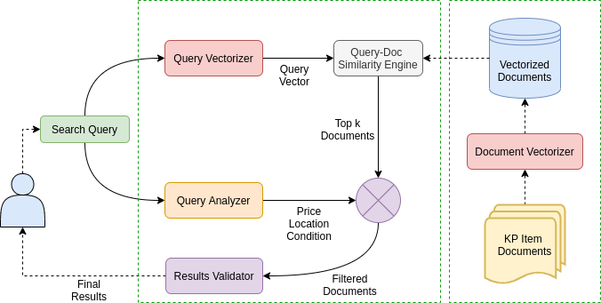

# Natural Language Search Engine for KP Ads

<p align="center">
  
</p>

## Getting Started

Requirements:

* `python 3.7+`
* `poetry`
* `pyenv`
* `make`

Install dependencies in activated environment with:

```
$ poetry install
```

Fetch data from elasticsearch, transform it and train word vectors with:

```
$ ES_HOST=<elasticsearch-host> ES_INDEX=<ads-index> make train
```

For example, if elasticsearch server is running on `localhost:9200` and KP ads
are in `ads` index, word vector training is started with:

```
$ ES_HOST=localhost:9200 ES_INDEX=ads make train
```

Raw ads are saved to

```
data/raw/ads.csv
```

processed ads in form of text lines are saved to

```
data/processed/ads.txt
```

and trained `fastText` models are saved to

```
models/ads.{dim}.bin
```

where `dim` is dimension of word vectors used in training.

## Data

Ad documents look like this:

```json
{
  "id" : 94337789,
  "url" : "/smartphones/samsung/samsung-j5/ad/94337789",
  "name" : "Ad name",
  "description" : "Ad description",
  "category" : "smartphones",
  "subCategory" : "samsung",
  "currency" : "eur",
  "price" : "500",
  "html" : "...",
  "location" : "Novi Sad",
  "lat" : "45.2671352",
  "lon" : "19.8335496",
  "posted" : "2020-04-26T10:14:48.000Z"
}
```

When [data/fetch.py](./data/fetch.py) is executed, first the latest ad is read from
`data/raw/ads.csv`, if any.  Based on ad `id` and `posted_at` fields, only the
more recent documents are fetched from elasticsearch index.

Raw ads are transformed into human readable text lines suitable for skipgram
model. Check out [train.py](./train.py) for model hyperparameters and more
details.
